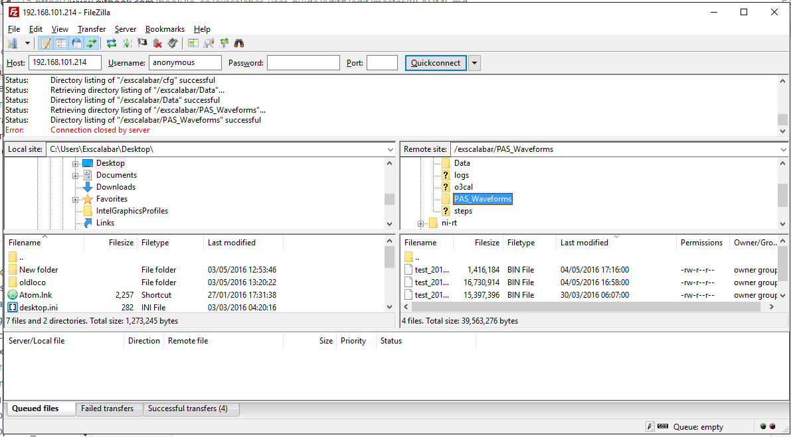
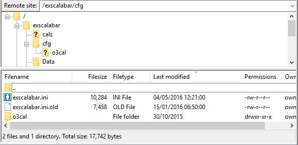
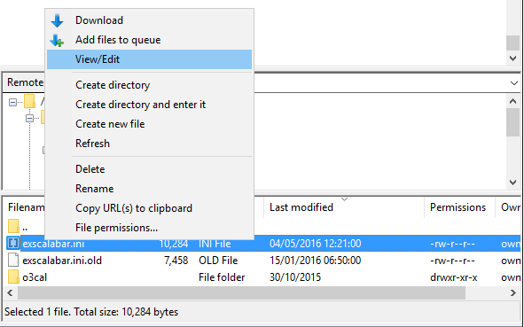
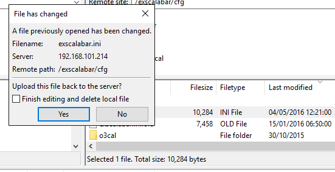

# Access
The configuration files reside on main drive of the server.  This drive is accessible via FTP or an http get.  The following examples use [FileZilla](https://filezilla-project.org) to access these files via ftp, but any ftp utility should be sufficient.  In order to access the server drive, the user must have the IP address of the server available.  **There is no user name or password required at this time to access the server**, but the server may be configured to utilize this functionality.

In the image below, we have logged on to gain access to the server drive using [FileZilla](https://filezilla-project.org).  The main directory in which files are placed by default is the ``exscalabar`` directory.  

One in the ``exscalabar`` directory, navigate to the ``cfg`` directory.  This directory contains the INI file for the system configuration.  This file is called **``exscalabar.ini``**.  Located within this directory is also the location of the calibration directory (currently called ``o3cal``).

If the user wishes to edit the file that is on the server, there are two choices on how to do this.  The user may right click on the file and select ``View/Edit`` (if using [FileZilla](https://filezilla-project.org)).  This will open a file in whatever application the user has configured the client to open an INI file (the default is Notepad on Windows machines).  

If the user opts to use this method for accessing the INI file, [FileZilla](https://filezilla-project.org) will prompt the user to upload this file back up to the server.  If the user is finished editing the configuration file, they may choose to upload the updated file and delete the local copy or simply just upload the current file.

A safer alternative to this method is to download the file to somewhere that is backed up and edit the file and upload the edited file.  **Best practice: before altering the current file, save that file on the server as something that is not ``exsalabar.ini`` (such as ``exscalabar.ini.old``).**  This will preserve the current copy on the server for reuse if needed.