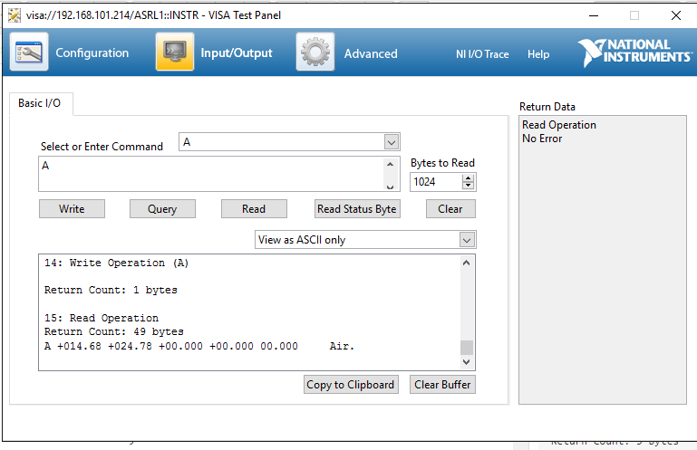
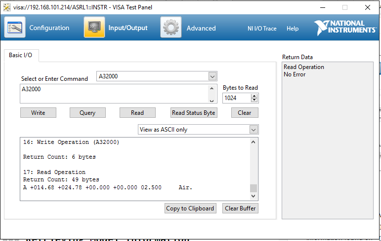
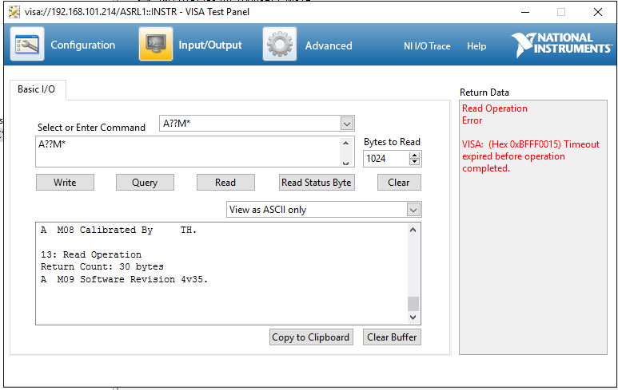

# Alicat
## Serial Settings
19200 8N1
Carriage return to write and read data


## Commands

``{Address}`` is the device address.
### Retrieving Current Values and setting setpoints

``{Address}`` - retrieves data from device


``{Address}{Setpoint Value}``



### Retrieving Model Information
* ``{Address}??M*`` - retrieves all model information
* ``{Address}??M{line no.}`` - retrieves modle information found on ``{line no.}``



Retrieved model information
```
1: Device Clear Operation

2: Write Operation (A??M*)

Return Count: 5 bytes

3: Write Operation (A??M*)

Return Count: 5 bytes

4: Read Operation
Return Count: 25 bytes
A  M00 ALICAT SCIENTIFIC.

5: Read Operation
Return Count: 8 bytes
A  M01 .

6: Read Operation
Return Count: 25 bytes
A  M02 Ph   520-290-6060.

7: Read Operation
Return Count: 25 bytes
A  M03 Fax  520-290-0109.

8: Read Operation
Return Count: 32 bytes
A  M04 Model Number  MC-5SLPM-D.

9: Read Operation
Return Count: 28 bytes
A  M05 Serial Number 104488.

10: Read Operation
Return Count: 36 bytes
A  M06 Date Manufactured 07/23/2014.

11: Read Operation
Return Count: 36 bytes
A  M07 Date Calibrated   07/23/2014.

12: Read Operation
Return Count: 28 bytes
A  M08 Calibrated By     TH.

13: Read Operation
Return Count: 30 bytes
A  M09 Software Revision 4v35.

```

