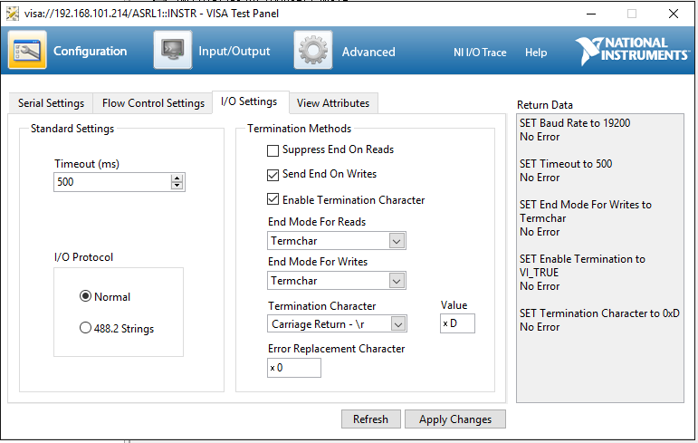

# Alicat
## Serial Settings
19200 8N1
Carriage return to write and read data

## Commands

* ``{Address}`` - retrieves data from device
* ``{Address}??M*`` - retrieves all model information
* ``{Address}??M{line no.}`` - retrieves modle information found on ``{line no.}``

