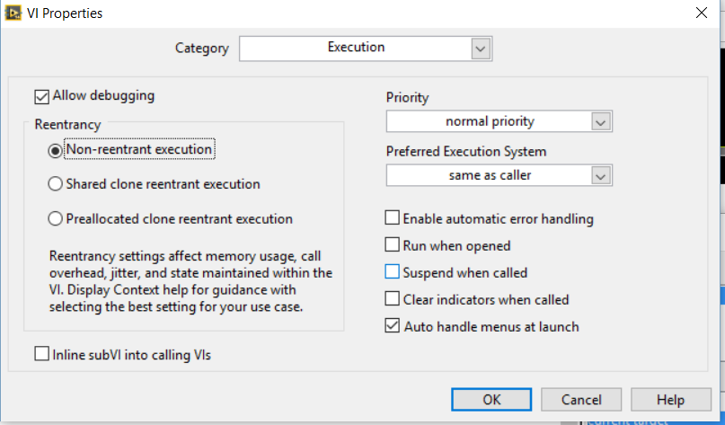

# General Tips and Tricks
## Using Git
The version control system used at the time or writing is git.  The repository is maintained on [Github](http://github.com).  Currently, there are two separate repositories for the project:

* [exscalabar](http://github.com/lo-co/exscalabar) - this repository is used for storing user interface code.
* [exscalabar_server](http://github.com/lo-co/exscalabar)

## Debugging
## Setting Reentrancy for VIs
The majority of the Actor Framework relies on VIs that are reentrant.  This means that the VIs run in their own memory space and the state of one has no impact on another instance.  This is a powerful tool for running tasks in parallel.  The key problem with reentrancy on a real-time system is that the reentrant aspect relies on the instance having a unique front panel for debugging access.  As there are no front panels in on a real-time system, this means that reentrant VIs are not directly accessible through traditional debugging techniques.

## Clearing the Compiled Cache
Occasionally, when debugging, the user may get an error on deployment (i.e. when they try to run a program or deploy the web service) that states there is an error with a VI.  Upon opening the VI, the user will find that the VI is actually not broken.  At this point, it would be best to clear the compiled cache (where the actual object code is stored), close the project and open it again.  This *should* resolve these problems.

The user may clear the compiled cache one of two ways.  They may clear it through the LabVIEW environment or by deleteing the object data folder.  To clear the cache through the environment (see image below):

* navigate to the *Tools* menu on any screen in the LabVIEW environment (this is shown below within a project, but may also be done through a VI, library, etc.)
* Select *Advanced* from the *Tools* menu
* Click on *Clear Compiled Object Cache...*
* In the window that pops up, click the button *Delete*

This will remove the object file in the *LabVIEW Data->VIObjCache->[version]* folder.

Alternatively, the user may close the entire LabVIEW environment (i.e. shut it down) and simply delete the folder described above directly.  The folder is usually found under the users *Documents* folder in Windows.

