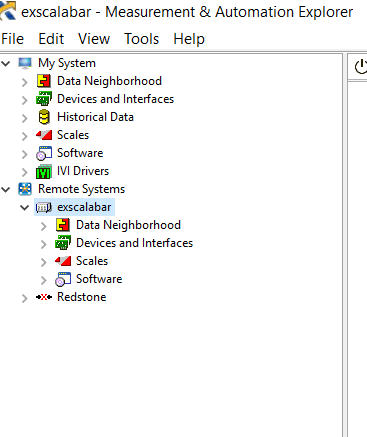

# Hardware
Hardware in the system may be accessed via the NI Measurement and Automation Explorer (MAX) when the host computer is connected to the powered chassis.  To access a description of the hardware, 

* Open MAX
* Click on *Remote Systems* to expand the list of systems connected to the host via the network.
* Click on *exscalabar* to view the list of accessible options regarding the chassis.

## Chassis Network
In order for the system to communicate with the 

