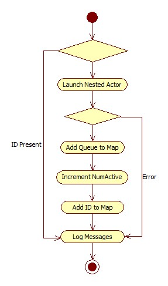

# Operational Overview
Below is an [activity diagram](https://www.ibm.com/developerworks/rational/library/2802.html) demonstrating the launch sequence of the system.  When running in the LabVIEW environment for debugging purposes, the user will start the program by running ``Launcher`` found in the ``Main Launch`` folder (the only file in the folder) in the project.  The ``Launcher`` VI has one thing that it does - it simply launches the ``Controller`` actor object.

As with every ``Actor`` object, the ``Controller`` has a set of actions that it will perform.  Each ``Actor`` in the system will run the ``Actor::Pre Launch Init`` when launched.  In the EXSCALABAR DAQ, this is where all configuration will occur.  If an error is thrown here, then the ``Actor`` *should* shutdown without sending a last ack to the actor in which it is nested.  In the case of the ``Controller``, this means that a fail at launch will result in a failure to launch.  The error is fatal because the ``Controller`` is the hub of all activity - most messages will pass through this ``Actor`` at some point.

If the launch is successful, the ``Actor::Actor Core`` process will kick off and continue until a stop message is sent.  A stop message may be sent by the user via a command to halt the system *or* if an error is thrown and not handled properly in the core itself.  The ``Actor Core`` is where all messages will be handled by the ``Actor``.  Processes can (and usually are) run in parallel to the main ``Actor Core`` implementation.

In the EXSCALABAR DAQ, the ``Controller`` will kick off the ``Controller::Actor Core`` operations by launching all nested actors.  The launching process is wrapped in the ``Controller::Launch Nested`` method.  This sequence of events in this method is shown in the figure below.  This method excepts an input called ``ID`` which will be used to directly ID the nested actor in the case where the ``Controller`` needs to send a message

In this method, the ``Controller::Enqueuer MAP`` property will be queried to figure out if another ``Actor`` with this ``ID`` was already launched; if it was, it will write a message to the log indicating this to be the case.  

> **``Enqueuer MAP``**
>
> This map is one of several that occurs throughout the code.  Each MAP object is simply a variant with properties attributed to it that are accessed through the ``Get Variant Attributes`` or ``Set Variant Attributes``.  The MAP allows wrapped access to key-value pairs of data (similar to Python's dictionary structure.
> 
> In the case of the ``Controller::Enqueuer MAP`` property, the variant will contain the following attributes:
> 
> * ``IDs`` - an array of strings that is a simple list of IDs of nested actors that have been registered with the MAP.
> * ``NumActive`` - this is the number of nested actors that are represented in the MAP.
> * a variant attribute with each corresponding to each ID in the ``IDs`` attribute that contains the ``Enqueuer`` for that nested actor.

If it was not, then this method will attempt to launch the nested actor by calling the ``Actor::Launch Nested Actor``.  If it is successful, then this method will return with an ``Enqueuer`` for that actor.  That ``Enqueuer`` will be stored in the ``Controller::Enqueuer MAP`` under it's respective ID, the number of nested actors represented in the map will be incremented and the ID will be added to the ``IDs`` attribute in the map.  If the launch fails, then an error *should* be returned and the ``Controller::Enqueuer MAP`` is never touched.  The error message is logged in the message stream.

Well defined ``IDs`` are as follows:

* ``PAS``: 
* ``CRDS``: 
* ``AC Network``:
* ``Main``:
* ``Mirror``:

Some well defined ``IDs`` that are not launched every time:

* 