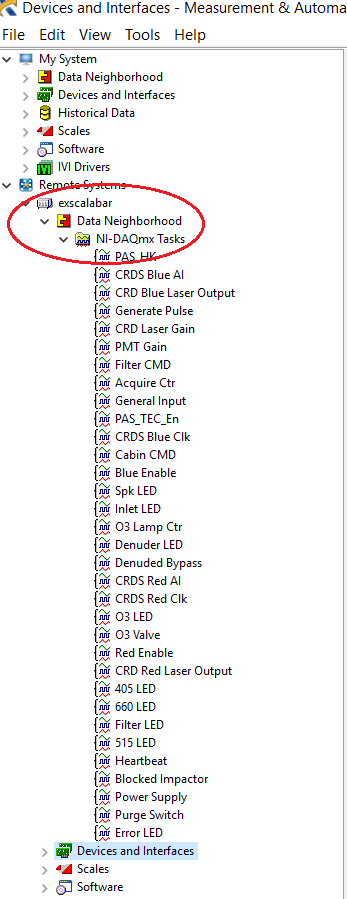
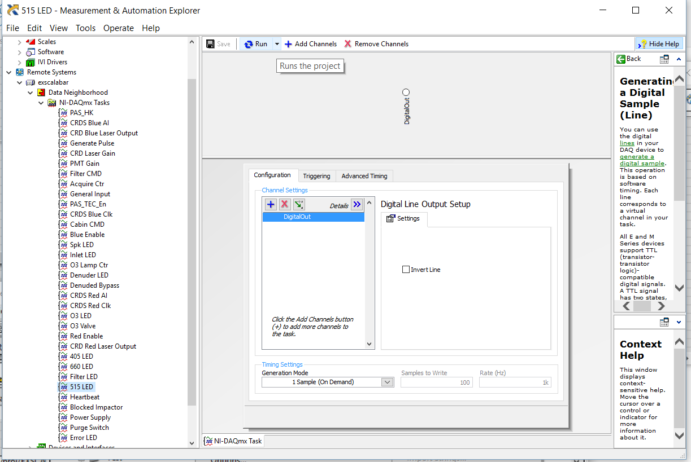

# MAX Tasks
Most analog and digital communication is performed directly through DAQmx, the native DAQ driver for communication with National Instruments devices.  All communication with NI devices is configured through Tasks in MAX.  To view available tasks or to create new ones, the user must

* navigate to the remote system (**exscalabar**)
* select *Data Neighborhood* to expand this folder 
* select *NI-DAQmx Tasks* to view the currently configured tasks

The user may directly interact with the hardware via the preconfigured tasks by selecting double-clicking on the task and clicking the run button (see below).  The user will have the same options as with running a VI - run once or run continuously.  How the user desires to interact with the task will determine how they use this button.  For some operations, such as digital outputs, they are defined to be **1 Sample (on demand)** as in the image below.  In this case, the user will likely want to run continuously, so that they may toggle the switch without having to hit the run button every time they are testing.

## Description of the Tasks

### Hardware in MAX

The hardware in MAX is defined under *Devices and Interfaces* in the system *exscalabar*.  Under *Devices and Interfaces*, the user can expand the tab for the chassis labeled as ``NI PXIe-1078``.  The the individual pieces of the chassis are defined under this tab and are numbered according to their position in the chassis.  The first slot is always the computer itself, ``NI PXIe-8135``. 

The individual cards follow after the computer.  All cards are aliased such that their names reflect the initially intended function of the card.   The cards are currently defined as follows:

2. ``PXIe-8431/8`` - this is the 8 channel RS485 card.
3. ``PXIe-6124``  aliased as ``CRD_Blue`` - this card is a high speed, 4 channel AI card intended to capture the blue ringdown signal.
4. This slot is currently unoccupied.
5. ``PXI-6132`` aliased as ``CRD_Red`` - this card is another high speed, 4 channel AI card intended to capture the red ringdown signal.  This card can capture 4 channels of AI simultaneously at up to 2.5 MHz per channel.
6. ``PXI-6704`` aliased as ``TEC_AO`` - 
7. ``PXI-6225`` aliased as ``PAS_HK`` - this card was intended to capture housekeeping data associated with the photoacoustic spectorometer.
8. ``PXI-6225`` aliased as ``CRD_HK`` - this card is a multifunction DAQ card intended to handle the housekeeping operations associated with the CRD.
9. ``PXI-7842R`` - this card is not aliased and is the multifunction, reconfigurable DAQ card that handles much of the PAS IO.  This card requires an FPGA bitfile to operate.

### Task Definitions

