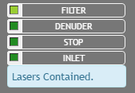

# Shutting the System Down
When the user needs to shut down the system, they may simply hit the power button on the PXI chassis.  However, the *proper* way to shut the system down is to press the button located on the sidebar labeled ``STOP``.  When this button is pressed, a signal will be sent from the ``Controller`` to all actors to perform a normal stop.  When all actors have successfully shutdown, the ``Controller`` itself will perform a normal shutdown which will cause the LED on the ``STOP`` button to turn off and the LED on the front panel to on the chassis front panel.

