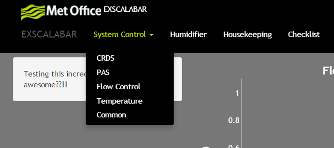
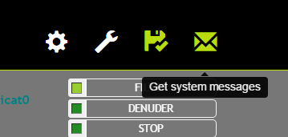

# Navigating the User Interface
## The Navigation Bar
The navigation bar consists of two parts.  The left hand side provides access to different portions of the system for direct control and visualization.  The elements are defined by functionality and are the portions of the menu that may be accessed more frequently. The left hand portion of the navigation bar is text based to provide a more clear pointer to systems unique to *EXSCALABAR*.

## Shutting the System Down
