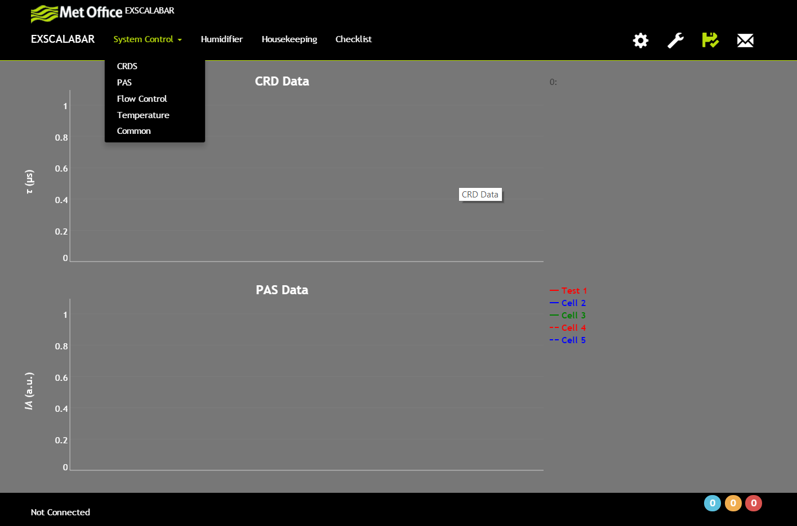

# The User Interface
An overview of the user interface is show below.  The user interface is a responsive, single page application (SPA) developed using the [AngularJS](https://angularjs.org) framework and [Twitter Bootstrap version 3](http://getbootstrap.com).  The former is a javascript framework that provides the functionality to develop an SPA while the latter provides the css and some javascript the responsive behavior.  

