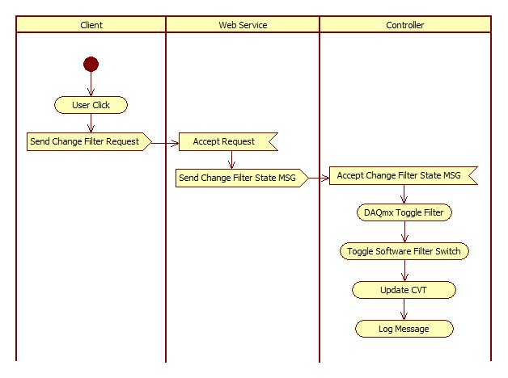

# Web Service

| Resource | VI | URL | Response |
| -- | -- | -- | -- |
| **``General``** | ``UpdateFilter`` | ``/xService/General/UpdateFilter?State={value}`` | Sends message to controller - ``Change Filter State`` |
|  | ``DenuderBypass`` | ``/xService/General/DenudedBypass?val={value}`` | Sends message to controller - ``Change Denuder State MSG`` |
| | ``Cabin`` | ``/xService/General/Cabin?val={value}`` | Sends message to ``Controller`` - ``Change Inlet MSG`` |
| 0:5 | 1:5 | 2:5 | 3:5 |
| 0:6 | 1:6 | 2:6 | 3:6 |
| 0:7 | 1:7 | 2:7 | 3:7 |
| 0:8 | 1:8 | 2:8 | 3:8 |
| 0:9 | 1:9 | 2:9 | 3:9 |
| 0:10 | 1:10 | 2:10 | 3:10 |
| 0:11 | 1:11 | 2:11 | 3:11 |
| 0:12 | 1:12 | 2:12 | 3:12 |
| 0:13 | 1:13 | 2:13 | 3:13 |
| 0:14 | 1:14 | 2:14 | 3:14 |
| 0:15 | 1:15 | 2:15 | 3:15 |
| 0:16 | 1:16 | 2:16 | 3:16 |

## Communication Errors

There are two kinds of communication errors that can occur.  The first occurs because the web service is not available.  In this case, the client will throw an error (in the console) to the effect of ``ERR_CONNECTION_TIMED_OUT``.

In the second case, the web service may be available, but the message queues are not good.  This may be due to a real problem with the ``Controller`` or simply because the ``Controller`` is not running.  In either scenario, attempts to access the queue will result in an error and the server will return the code 503.